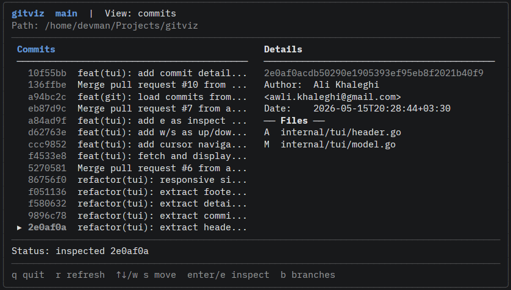
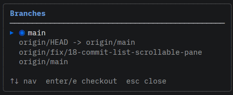

<p align="center">
  
  
</p>

<h1 align="center">gitviz</h1>

<p align="center">
  <a href="https://github.com/alikhaleghi/gitviz/blob/main/LICENSE"></a>
  <a href="https://go.dev/"></a>
  <a href="#keyboard-controls"></a>
</p>

A keyboard-driven terminal UI for exploring Git history, inspecting commits, and navigating branches — all without leaving your terminal.

```bash
go install github.com/alikhaleghi/gitviz/cmd/gitviz@latest
```

---

## Features

- **Inline diff viewer** — full unified diff with green/red highlighting in details pane
- **Copy commit hash** — press `y` to copy selected hash to clipboard
- **Blame view** — press `B` on a file to see line-by-line authorship
- **Compare commits** — press `Space` on two commits to see the delta
- **Commit browser** — scroll through recent commits with real-time detail loading
- **Commit inspector** — author, date, full message, and changed files at a glance
- **Branch list & checkout** — browse and switch branches inline
- **Dual-pane layout** — responsive split adapts to your terminal width
- **Fully keyboard-driven** — never reach for the mouse
- **Contextual help** — footer hints change based on what you're doing
- **Git CLI-native** — no CGO, no libgit2, just `git` commands

## Keyboard Controls

| Key | Action |
|---|---|
| `↑` `↓` / `k` `j` / `w` `s` | Navigate commit list |
| `Enter` / `e` | Inspect commit / checkout branch |
| `Tab` / `Shift+Tab` | Switch focus / close branch modal |
| `Esc` | Return to commit list / close modal |
| `b` | Toggle branch list |
| `r` | Refresh commit log |
| `y` | Copy commit hash to clipboard |
| `Space` | Select commits for comparison |
| `B` | Open blame view on first file |
| `q` / `Ctrl+C` | Quit |

## Getting Started

### Install

```bash
# Install globally
go install github.com/alikhaleghi/gitviz/cmd/gitviz@latest

# Then run from any Git repo
cd my-project
gitviz
```

### From source

```bash
git clone https://github.com/alikhaleghi/gitviz.git
cd gitviz
make run        # run directly
# or
make build      # build to ./bin/gitviz
./bin/gitviz
```

### Prerequisites

- Go 1.24+
- Works best inside a Git repository (run it outside one too — you'll get a helpful hint)

## Project Structure

```
cmd/gitviz/          # Application entrypoint
internal/
├── app/             # Domain logic (coming soon)
└── tui/             # TUI components
    ├── model.go     # Core state, update loop, git operations
    ├── header.go    # Header bar renderer
    ├── commitlist.go# Commit list pane
    ├── details.go   # Commit detail inspector
    ├── branches.go  # Branch modal and checkout
    ├── footer.go    # Status strip and help bar
    └── styles.go    # Lip Gloss styles and helpers
pkg/                 # Reusable packages (future)
```

Every UI state — no repository, no commits, commit selected, load error — has a dedicated rendering path. No blank screens.

## Built With

- [Bubble Tea](https://github.com/charmbracelet/bubbletea) — Go TUI framework (Model-View-Update)
- [Lip Gloss](https://github.com/charmbracelet/lipgloss) — terminal styling

## Development

```bash
make run      # Run from source
make build    # Build binary to bin/gitviz
make test     # Run all tests
make fmt      # Format code
make lint     # Run go vet
```

### Design Principles

- **MVP first** — ship the smallest useful thing, then iterate
- **Keyboard-first** — every action must be reachable without a mouse
- **CLI-native** — shell out to `git` before reaching for complex integrations
- **No blank screens** — every pane has a meaningful empty, error, or loading state
- **Under a second** — startup must feel instant for normal-sized repos

## Roadmap

- [x] Project scaffold and TUI layout
- [x] Component architecture
- [x] Keyboard navigation
- [x] Git log integration
- [x] Commit detail inspector
- [x] Branch list and switcher
- [x] Branch checkout
- [x] Inline diff viewer
- [x] Copy commit hash
- [x] Blame view
- [x] Diff between two commits
- [ ] Graph rendering

## Versioning

[Semantic versioning](https://semver.org/) with pre-release stages: `vMAJOR.MINOR.PATCH[-STAGE.N]`

| Stage | Description |
|---|---|
| `dev` | Internal development snapshots |
| `alpha` | Early preview, core workflow exists |
| `beta` | Feature-complete for milestone, broader testing |
| *(none)* | Stable release |

Current: `v0.0.1-alpha.2`

## Contributing

See [CONTRIBUTING.md](docs/contributing.md) for branch naming, commit format, and PR workflow.

## License

MIT — see [LICENSE](LICENSE).
